# Игра "Тетрис" с функциями администратора
## Информация
Проект разрабатывался в рамках выполнения курсовой работы по дисциплине «Программная инженерия» 7 семестра направления "Фундаментальная информатика и информациионные технологии" Самарского университета.

Выполняли: студенты группы 6415 Кочелаевская А.А., Тимонина А.В.

Руководитель: Зеленко Л.С.

Во время курсового проектирования разработаны алгоритмы и веб-приложение, реализующее правила игры «Тетрис», в котором реализована роль администратора. Администратор может работать с уровнями сложности, фигурами и стаканами. Игрок может играть в «Тетрис» с заданными настройками. Вся информация об уровнях сложности, фигурах и стаканах хранится в базе данных.

Программа написана на языке С# в среде Visual Studio 22 и функционирует под управлением операционной системы Windows 7 и выше. Доступ к данным осуществляется с помощью СУБД MS SQL Server 16.0.

## Описание интерфейса пользователя
Страницы авторизации и регистрации.

<picture>
 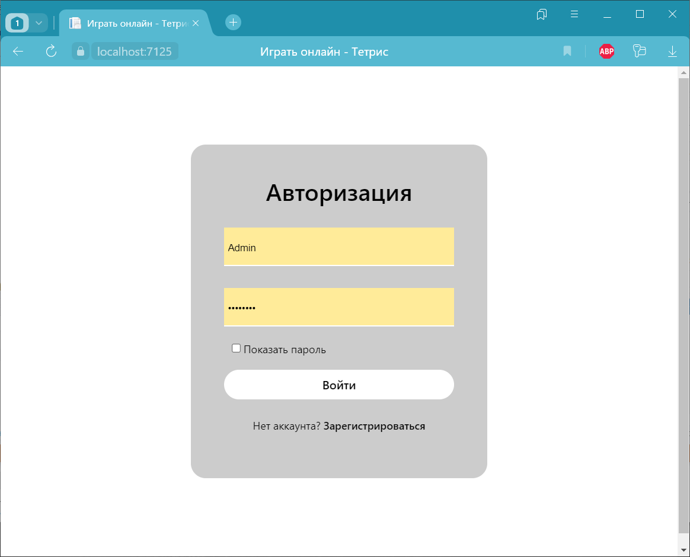
</picture>
<picture>
 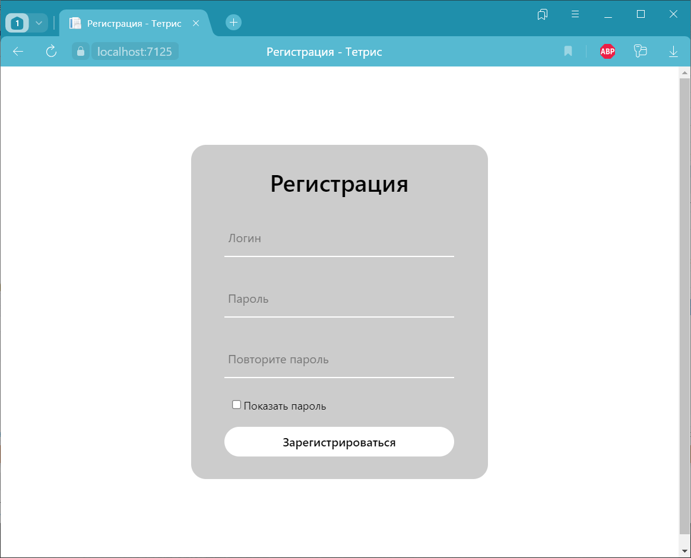
</picture>

### Функционал администратора

Меню

<picture>
 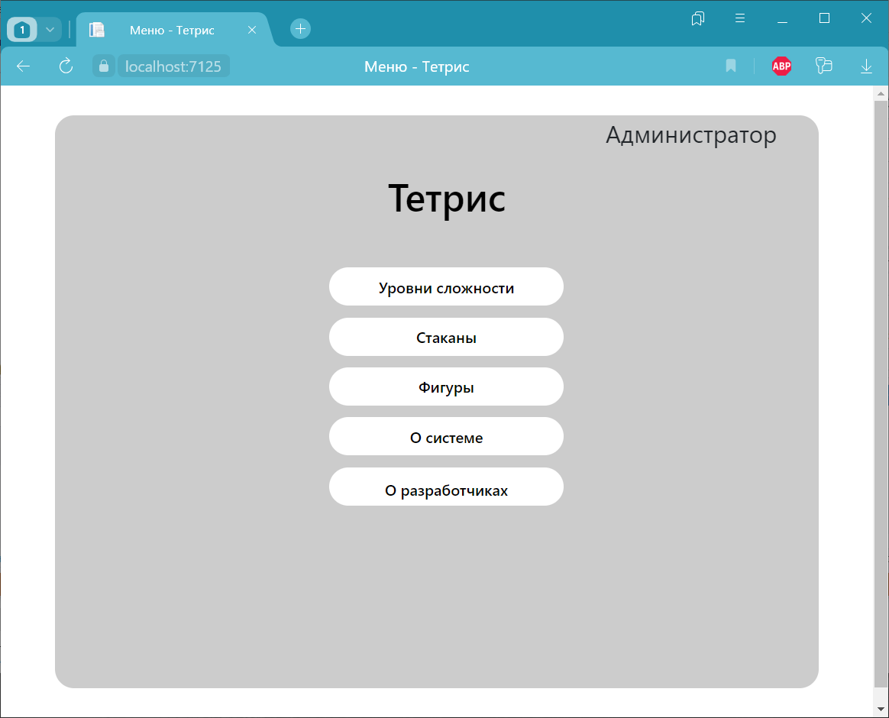
</picture>

Страницы редактирования и/или добавления объектов

<picture>
 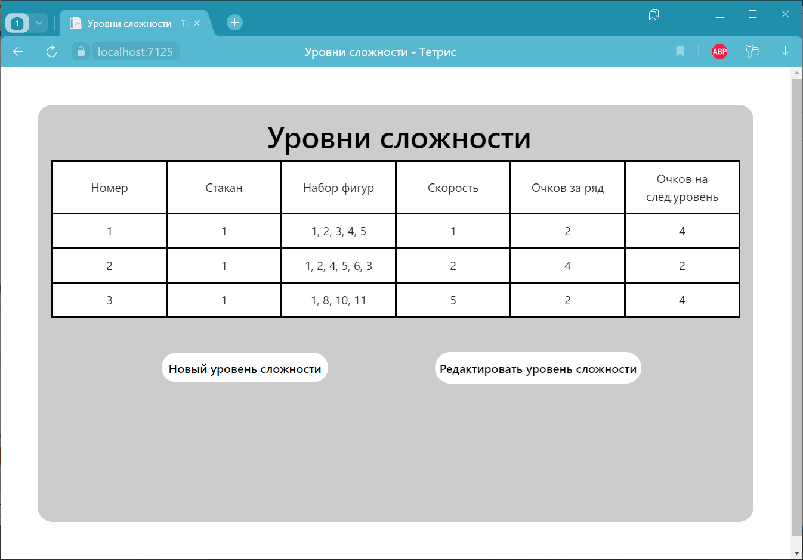
</picture>
<picture>
 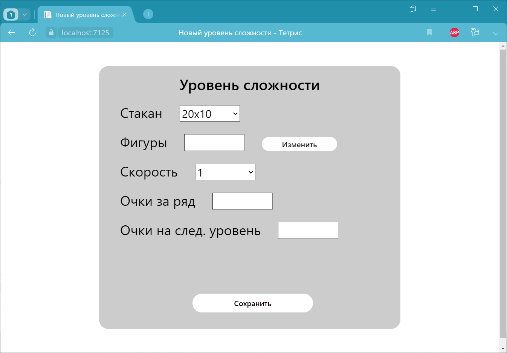
</picture>
<picture>
 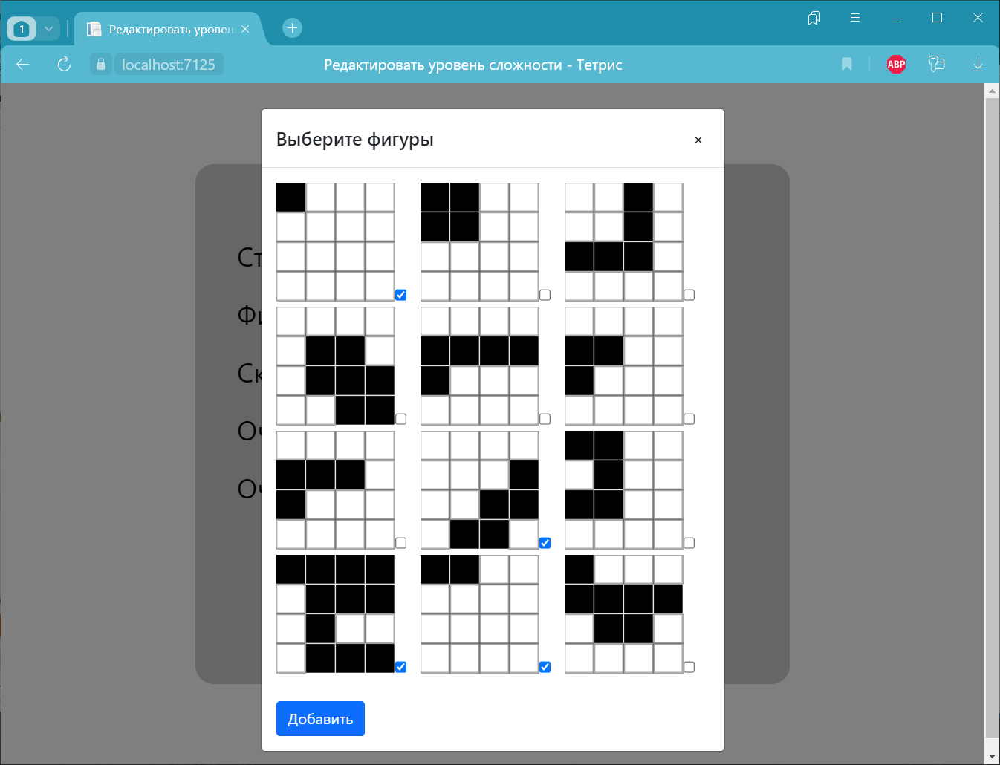
</picture>
<picture>
 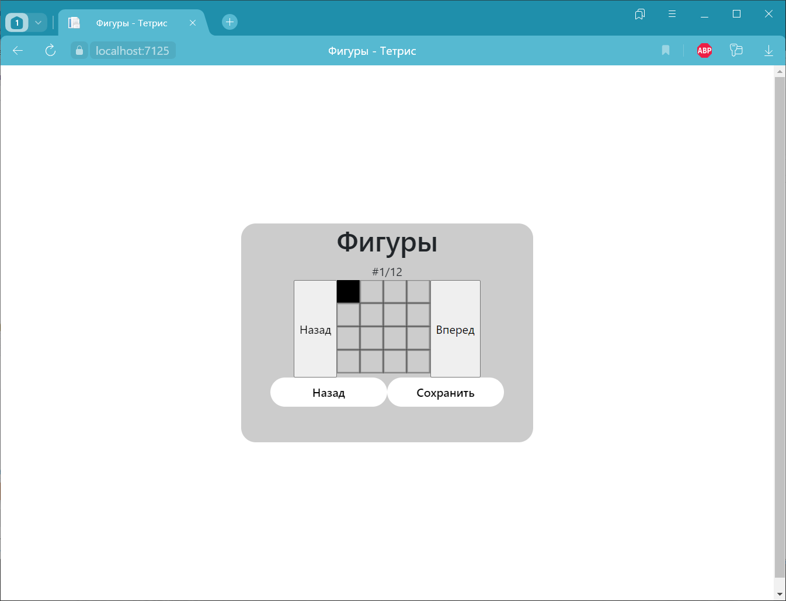
</picture>
<picture>
 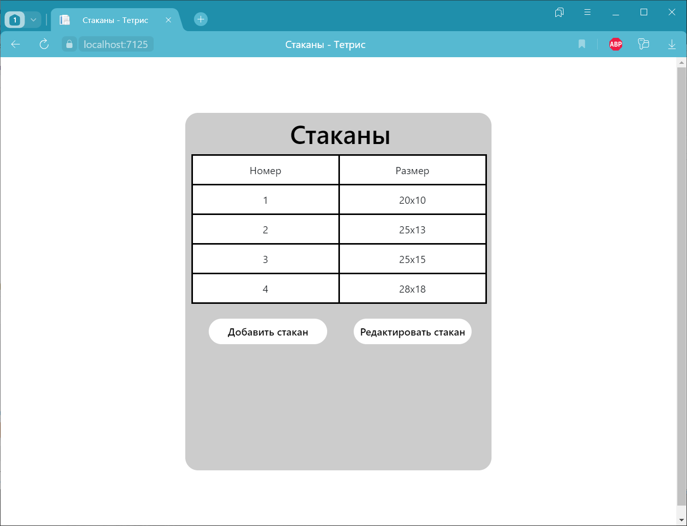
</picture>

### Функционал игрока

Меню

<picture>
 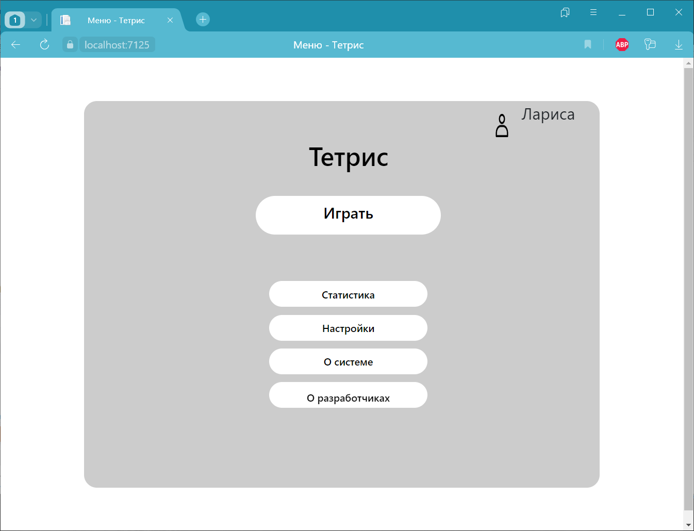
</picture>

Страницы настроек игры и перед игрой

<picture>
 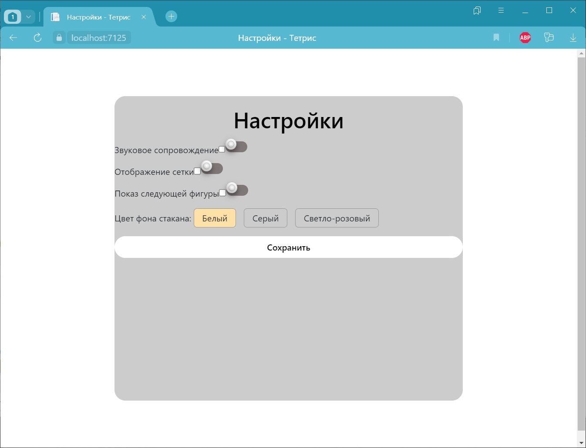
</picture>
<picture>
 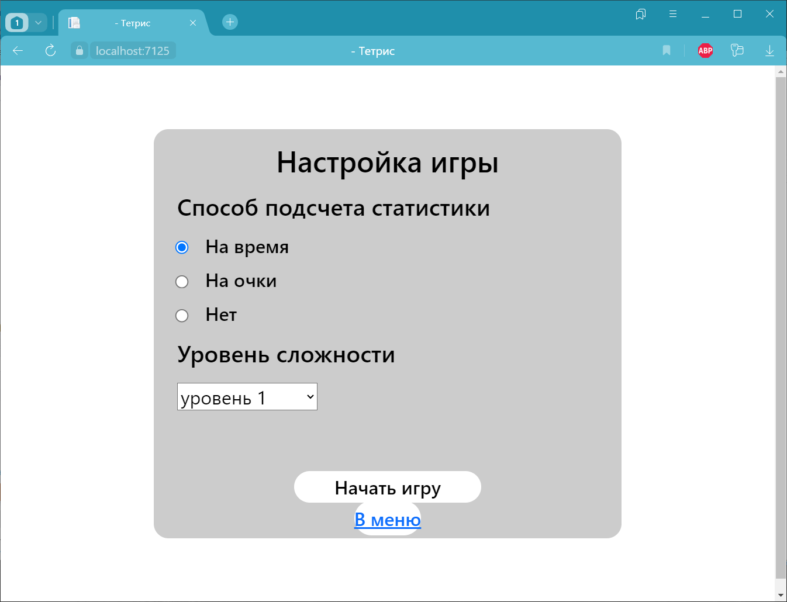
</picture>

Игра

<picture>
 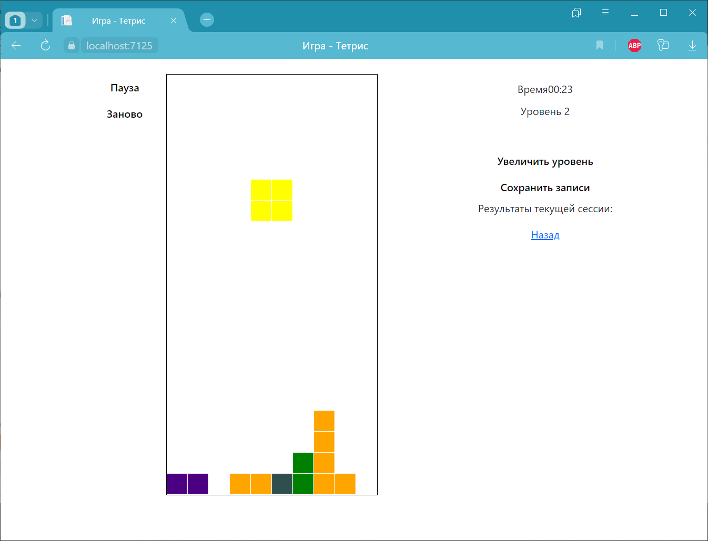
</picture>

Статистика

<picture>
 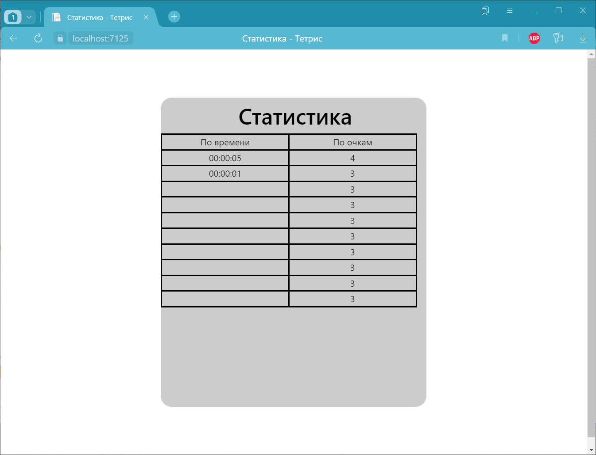
</picture>
